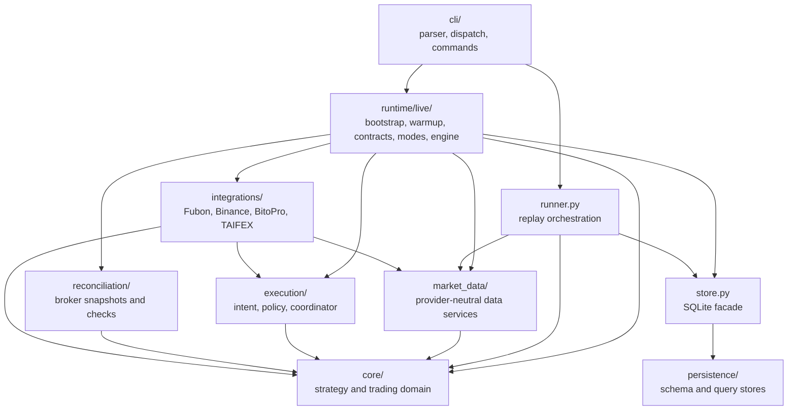

# Project Lux

MVP pairs-trading architecture for replaying the QFF/TSM proof of concept through a
single-process loop, a paper broker, and a SQLite state store.

## Project Background

Project Lux is the deployable implementation track for a QFF/TSM pairs-trading idea
that was first validated in the proof-of-concept workspace:

```text
D:\Users\Documents\Proof of Concept
```

The PoC is the source of truth for the first version of the strategy logic: trading
targets, spread construction, rolling z-score behavior, entry/exit thresholds, sizing,
fees, QFF trading-calendar assumptions, and the reference backtest summary. Project
Lux should preserve that behavior unless a change is explicitly designed, documented,
and revalidated against the PoC reference.

This repository focuses on the production shape around that validated logic:
configuration, broker abstraction, market-data adapters, paper execution, SQLite
state recovery, CLI workflows, deterministic tests, and live market-data smoke tests.
The Phase 1 acceptance test is therefore not "does the idea look profitable again";
it is "does the Project Lux replay match the PoC trade count, direction, position,
PnL, and fees."

The first milestone intentionally does not use Fubon or Binance live APIs. It reads
the PoC CSV, recomputes the rolling z-score, runs the strategy state machine, records
paper orders/fills/trades, and supports resume from SQLite.

Current replay reference uses the PoC QFF-session dataset:

```text
data\processed\qff_tsm_spread_zscore_1m_taipei_qff_session_w500.csv
```

The strategy parameters are `zscore_window=500`, `entry_z=2.0`, and `exit_z=1.0`.
Indicators only consume QFF trading-session bars. QFF non-trading minutes are
excluded, while missing QFF minutes inside an active trading session are
forward-filled. `exit_z=1.0` means exit only after the spread crosses to the moving
average's opposite side: short-spread positions exit at `z < -1`, long-spread
positions exit at `z > 1`.

## Environment

This machine uses Miniconda. Run Python commands through the `Quant` environment:

```powershell
& 'D:\Users\miniconda3\condabin\conda.bat' run -n Quant python --version
```

For interactive live commands in PowerShell, prefer the project wrapper. It uses
the `Quant` environment and streams output with `conda run --no-capture-output`:

```powershell
.\scripts\lux.ps1 live-dry-run --config configs/config.live.smoke.local.toml --reset-store
```

Install test tooling:

```powershell
& 'D:\Users\miniconda3\condabin\conda.bat' run -n Quant pip install -r requirements-dev.txt
```

## Repository Layout

Runtime configuration is kept under `configs/`:

```text
configs/
- replay.example.toml
- live.example.toml
- *.local.toml
```

Paths inside project configs are resolved from the Project Lux repository root, not
from the `configs/` directory. Values such as `.env`, `data\...`, and
`data\taifex_cache` therefore continue to point to root-level deployment resources.

### Architecture



Dependency direction is one-way:

```text
core
  <- market_data / execution / reconciliation
  <- integrations / persistence
  <- runtime
  <- cli / terminal UI
```

Lower layers must not import orchestration or external API layers. In particular,
`core/` never imports CLI, runtime, SQLite, ccxt, or Fubon SDK modules. Live modes
share one runtime engine and vary only through their mode handler and execution
adapter.

### Module Responsibilities

| Module | Responsibility |
| --- | --- |
| `core/` | Strategy state machine, indicators, sizing, fees, calendars, contract policy, shared models |
| `market_data/` | Replay input, quote/bar types, minute aggregation, warmup assembly |
| `integrations/` | External Fubon, Binance, BitoPro, and TAIFEX adapters |
| `execution/` | Execution plans, outcomes, price policy, dry-run simulation, real coordination, safety gate |
| `reconciliation/` | Read-only broker snapshots, expected exposure, reconciliation, post-trade checks |
| `persistence/` | SQLite DDL and execution/reconciliation query implementations |
| `store.py` | Single public SQLite facade used by runtime and replay |
| `runtime/live/` | Shared startup, warmup, contract lifecycle, mode handlers, polling/finalization engine |
| `cli/` | Argument parsing, command dispatch, and command implementations |
| `terminal_ui.py` | Compact live terminal reporting only |

Pure strategy and trading-domain code is grouped under `lux_trader/core/`. Core may
depend on configuration value objects and general Python/data libraries, but it must
not import CLI code, SQLite stores, live runtime orchestration, or external broker
and market-data adapters. Integration and runtime modules depend on core, not the
other way around.

Provider-independent market-data services are grouped under
`lux_trader/market_data/`:

- `types.py`: quote/provider protocols and shared result models.
- `minute_bar.py`: second-level quote aggregation into finalized minute bars.
- `warmup.py`: QFF/TSM/USDT-TWD warmup assembly and source-quality reporting.
- `replay.py`: PoC CSV replay input.

External systems are grouped under `lux_trader/integrations/`:

- `fubon/`: shared authentication, response parsing, contract identity, market data,
  read-only accounting, and futures execution.
- `binance/`: TSM market data, read-only account access, and execution.
- `bitopro/`: USDT/TWD market data.
- `taifex/`: official historical data downloader.

Fubon SDK response normalization has one implementation in
`integrations/fubon/parsing.py`; execution and read-only adapters must not duplicate
that parser.

Execution domain code is grouped under `lux_trader/execution/`:

- `intent.py`: pair execution plans, legs, validation, and JSON restoration.
- `outcome.py`: execution outcome model, adapter protocol, and simulated adapter.
- `price_policy.py`: live top-of-book market-price policy.
- `simulation.py`: dry-run failure simulation cases.
- `real_coordinator.py`: two-leg real execution coordinator and emergency-close policy.
- `gate.py`: live execution safety gate.

Read-only broker reconciliation is grouped under `lux_trader/reconciliation/`:

- `models.py`: broker snapshots, expected exposure, issues, and reports.
- `brokers.py`: read-only broker protocol and fake broker.
- `reconciler.py`: expected-vs-actual broker reconciliation service.
- `post_trade.py`: post-real-execution consistency checks.

SQLite internals are grouped under `lux_trader/persistence/`. The public entry point
remains `SQLiteStore`; DDL lives in `schema.py`, execution queries live in
`execution_queries.py`, and reconciliation queries live in `reconciliation_queries.py`.

Live runtime orchestration is grouped under `lux_trader/runtime/live/`:

- `bootstrap.py`: provider initialization and startup preflight.
- `warmup.py`: auto warmup and QFF warmup check.
- `contracts.py`: active contract selection, switch handling, and force-exit checks.
- `modes.py`: paper, dry-run, and live-execute mode handlers.
- `engine.py`: shared polling and minute-finalize loop used by all live modes.

CLI code is grouped under `lux_trader/cli/`:

- `parser.py`: argument parser and subcommand definitions.
- `dispatch.py`: command dispatch table and `main()`.
- `commands/replay.py`: replay, summary, and doctor commands.
- `commands/live.py`: live market data, warmup, QFF warmup check, and live-paper.
- `commands/broker.py`: read-only broker and reconciliation commands.
- `commands/execution.py`: dry-run, execution smoke, and live-execute commands.

The public `lux_trader.cli` package re-exports `main` and `build_parser`, so
`python -m lux_trader` and existing command names/arguments remain unchanged.

Legacy top-level re-export modules were removed. Import execution and live runtime
types from their owning packages, for example `lux_trader.execution.intent` and
`lux_trader.runtime.live`.

## Test Layout

```text
tests/
- unit/         pure domain, parser, adapter-fake, and policy tests
- integration/  SQLite, CLI, replay, shared live runtime, and coordinator tests
- smoke/        real Fubon/Binance/BitoPro/TAIFEX tests guarded by env markers
```

Existing pytest markers remain unchanged:

- `live_marketdata`
- `readonly_broker`
- `dry_run_smoke`

Default regression:

```powershell
& 'D:\Users\miniconda3\condabin\conda.bat' run -n Quant pytest -q
```

Targeted layers:

```powershell
& 'D:\Users\miniconda3\condabin\conda.bat' run -n Quant pytest tests/unit -q
& 'D:\Users\miniconda3\condabin\conda.bat' run -n Quant pytest tests/integration -q
```

## Commands

```powershell
& 'D:\Users\miniconda3\condabin\conda.bat' run -n Quant python -m lux_trader doctor --config configs/replay.example.toml
& 'D:\Users\miniconda3\condabin\conda.bat' run -n Quant python -m lux_trader replay --config configs/replay.example.toml --reset-store
& 'D:\Users\miniconda3\condabin\conda.bat' run -n Quant python -m lux_trader summary --config configs/replay.example.toml
& 'D:\Users\miniconda3\condabin\conda.bat' run -n Quant pytest
```

Phase 2 live market data with paper orders:

```powershell
& 'D:\Users\miniconda3\condabin\conda.bat' run -n Quant python -m lux_trader live-doctor --config configs/live.example.toml
.\scripts\lux.ps1 live-paper --config configs/live.example.toml --reset-store
.\scripts\lux.ps1 live-paper --config configs/live.example.toml --resume
```

`live-paper` is the normal Phase 2 system entrypoint. On startup it checks whether the
SQLite store already has enough seed bars for the selected QFF contract; if not, it
auto-runs the live warmup flow before polling quotes. Use `--skip-warmup` only when
you explicitly want startup to fail unless existing seed bars are already present.
`warmup-live` is still available as a debug/acceptance tool for manually rebuilding
seed bars without starting the live loop:

```powershell
& 'D:\Users\miniconda3\condabin\conda.bat' run -n Quant python -m lux_trader warmup-live --config configs/live.example.toml --reset-store
```

After startup, `live-paper` polls QFF, Binance TSM, and USDT/TWD quotes once per
second, but only evaluates the strategy after a completed minute. QFF active-symbol
selection uses the expiry buffer policy: choose the earliest QFF contract with at
least 5 business days to expiry; if an old contract is already open, keep it until an
exit signal or the T-1 13:35 force-exit safety valve. It still uses `PaperBroker`; no
live order path exists in this phase. Set `LUX_LIVE_MARKETDATA=1` before `live-doctor`
only when you intentionally want a real market-data smoke test.

By default, `live-paper` shows a compact terminal UI: same-minute `LIVE` snapshots
refresh on one line, finalized `BAR` rows and warnings/events are printed on separate
lines. Use `--quiet-ui` to disable it or `--no-color` to keep the UI without ANSI
colors. Live entry/exit signals use bid/ask-adjusted tradable spreads while `mid`
remains available as the PoC/reference spread. Unlike replay/backtest, live modes
execute immediately after the finalized minute confirms the signal:

```text
09:12:04 LIVE mid=1.84 shortSpread(spread=1.62,z=1.51) longSpread(spread=2.06,z=1.93) FLAT
09:14 BAR  mid=2.24 z=2.06 shortSpread(spread=2.18,z=2.00) longSpread(spread=2.31,z=2.17) OPEN entry_fill pnl=-550 eq=999,450
```

Live runtime uses `[trading_calendar].closed_dates` for manually configured market
holidays. During a closed date or a non-trading session, the live loop does not fetch
quotes, does not finalize BAR rows, and only refreshes a yellow countdown line:

```text
02:31:04 LIVE non-trading session next=06/22 08:45 in=54:13:56
```

## Warmup-live testing

Run deterministic warmup tests without external APIs:

```powershell
& 'D:\Users\miniconda3\condabin\conda.bat' env list
& 'D:\Users\miniconda3\condabin\conda.bat' run -n Quant pytest tests/integration/test_live_market_data.py -q
```

Run real market-data smoke tests only when `.env` and the Fubon certificate are present
in the project root. Local TOML files live under `configs/`; the smoke config
`configs/config.live.smoke.local.toml` is intentionally ignored by git and writes to
`data\warmup_smoke.sqlite3`.

```powershell
$env:LUX_LIVE_MARKETDATA='1'
& 'D:\Users\miniconda3\condabin\conda.bat' run -n Quant python -m lux_trader live-doctor --config configs/config.live.smoke.local.toml
& 'D:\Users\miniconda3\condabin\conda.bat' run -n Quant python -m lux_trader qff-warmup-check --config configs/config.live.smoke.local.toml --output-csv=
& 'D:\Users\miniconda3\condabin\conda.bat' run -n Quant pytest tests/smoke/test_live_smoke.py -q -m live_marketdata
Remove-Item Env:\LUX_LIVE_MARKETDATA
```

The live smoke path logs into Fubon marketdata, resolves the expiry-buffer active QFF
contract, reads Fubon 1m candles, downloads TAIFEX previous-30-trading-day CSV ZIP files into
`data\taifex_cache`, fetches Binance `TSM/USDT:USDT` and BitoPro `USDT/TWD`, then runs
`warmup-live` through `WarmupRunner`. `qff-warmup-check` can be used alone to validate
the Fubon + TAIFEX QFF leg before touching Binance/BitoPro. Default passing criteria
are 500 QFF session `warmup_bars` and zero `bars`, `orders`, `fills`, or `trades`.

The full startup smoke in `tests/smoke/test_live_smoke.py` uses
`data\live_paper_startup_smoke.sqlite3`: it starts `live-paper` from an empty store,
expects `warmup_auto start/done_<warmup_bars>`, polls real quotes long enough to finalize or
skip a minute with a recorded warning, then runs a second `--resume` style pass and
checks that warmup is not rebuilt.

## Broker Reconciliation Skeleton

Phase 3 starts with a read-only broker reconciliation skeleton that does not touch
Fubon or Binance private APIs. Use fake brokers to validate the local data flow:

```powershell
& 'D:\Users\miniconda3\condabin\conda.bat' run -n Quant python -m lux_trader broker-doctor --config configs/live.example.toml
& 'D:\Users\miniconda3\condabin\conda.bat' run -n Quant python -m lux_trader reconcile-brokers --config configs/live.example.toml --fake
```

`reconcile-brokers --fake` writes a reconciliation report to SQLite. Mismatches are
recorded as `warning` and do not block `live-paper` in this phase.

After `.env` contains Fubon credentials plus `BINANCE_API_KEY` / `BINANCE_SECRET`, run
real read-only smoke tests explicitly:

```powershell
$env:LUX_READONLY_BROKER='1'
& 'D:\Users\miniconda3\condabin\conda.bat' run -n Quant python -m lux_trader broker-doctor --config configs/live.example.toml
& 'D:\Users\miniconda3\condabin\conda.bat' run -n Quant python -m lux_trader reconcile-brokers --config configs/live.example.toml --readonly
& 'D:\Users\miniconda3\condabin\conda.bat' run -n Quant pytest tests/smoke/test_readonly_brokers_smoke.py -q -m readonly_broker
Remove-Item Env:\LUX_READONLY_BROKER
```

## Dry-run And Phase 5 Extension Point

Phase 4 dry-run execution uses the same execution pipeline shape planned for live
orders, but with a simulated adapter. It records the pair execution plan, simulates
full fills, writes simulated `DRYRUN-*` orders/fills, and updates strategy state just
like a real execution outcome would. No Fubon or Binance order API is called.

```powershell
.\scripts\lux.ps1 dry-run-doctor --config configs/live.example.toml
.\scripts\lux.ps1 live-dry-run --config configs/live.example.toml --reset-store
.\scripts\lux.ps1 execution-summary --config configs/live.example.toml
```

Full dry-run validation has two layers. The default deterministic suite must pass
without touching external APIs:

```powershell
& 'D:\Users\miniconda3\condabin\conda.bat' run -n Quant pytest -q
```

The real API smoke requires the ignored `configs/config.live.smoke.local.toml`, Fubon
credentials, Binance read-only keys, and explicit gates. It writes to
`data\live_dry_run_full_smoke.sqlite3`. Accepted dry-run entry plans should create
simulated `DRYRUN-*` orders/fills and move the strategy to `OPEN`; simulated exit
plans close the position and write the trade/PnL record. `PAUSED` is reserved for
rejected, failed, partial, or unknown execution outcomes.

```powershell
$env:LUX_LIVE_MARKETDATA='1'
$env:LUX_READONLY_BROKER='1'
& 'D:\Users\miniconda3\condabin\conda.bat' run -n Quant python -m lux_trader live-doctor --config configs/config.live.smoke.local.toml
& 'D:\Users\miniconda3\condabin\conda.bat' run -n Quant python -m lux_trader dry-run-doctor --config configs/config.live.smoke.local.toml
& 'D:\Users\miniconda3\condabin\conda.bat' run -n Quant python -m lux_trader reconcile-brokers --config configs/config.live.smoke.local.toml --readonly
& 'D:\Users\miniconda3\condabin\conda.bat' run -n Quant pytest tests/smoke/test_dry_run_smoke.py -q -m "live_marketdata and readonly_broker and dry_run_smoke"
Remove-Item Env:\LUX_LIVE_MARKETDATA
Remove-Item Env:\LUX_READONLY_BROKER
```

For a manual 10-15 minute soak, use the same smoke config:

```powershell
$env:LUX_LIVE_MARKETDATA='1'
.\scripts\lux.ps1 live-dry-run --config configs/config.live.smoke.local.toml --reset-store --max-iterations 900 --no-color
Remove-Item Env:\LUX_LIVE_MARKETDATA
```

Phase 5 `live-execute` now uses the same live runtime as `live-paper` and
`live-dry-run`: auto warmup, quote polling, minute finalization, tradable bid/ask
spread decisions, trading calendar, and QFF contract policy are shared. The mode
only swaps the execution layer to the real Fubon/Binance adapters and runs
post-trade read-only reconciliation after each real execution.

```powershell
& 'D:\Users\miniconda3\condabin\conda.bat' run -n Quant python -m lux_trader live-order-doctor --config configs/live.example.toml
& 'D:\Users\miniconda3\condabin\conda.bat' run -n Quant python -m lux_trader live-execute --config configs/live.example.toml --quiet-ui
```

`live-execute` is still gated by `safety.allow_live_order=true`,
`[live_execution].enabled=true`, `PROJECT_LUX_ALLOW_LIVE_ORDER=1`,
`FUBON_ALLOW_LIVE_ORDER=1`, `BINANCE_ALLOW_LIVE_ORDER=1`, and the configured
read-only reconciliation policy. Keep it disabled unless you are intentionally
running the minimal live-order acceptance path.

## Safety

`live-paper` and `live-dry-run` still refuse `allow_live_order=true` and cannot send
real orders. `live-execute` is the only live-order entrypoint, and it requires all
explicit config/env gates plus read-only broker reconciliation. Binance TSM and
Fubon TMF single-adapter entry/exit smoke tests have passed. Full two-leg
`live-execute` live-order acceptance is still pending and must pass before treating
the system as ready for unattended real execution.
